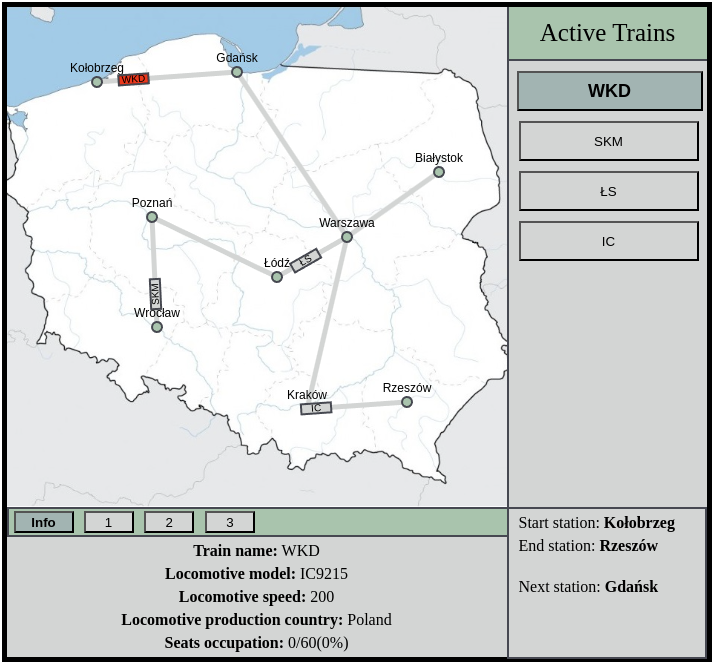
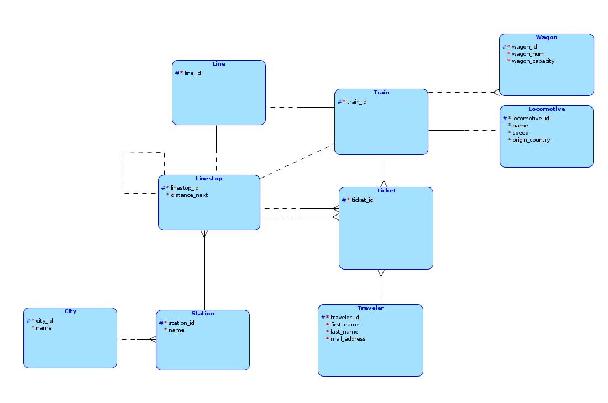
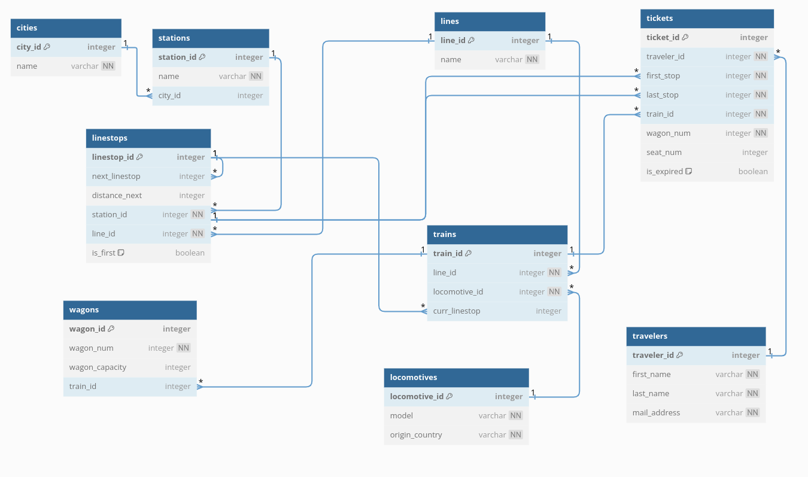
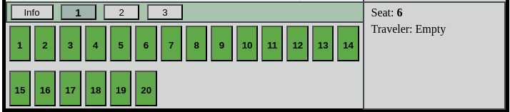
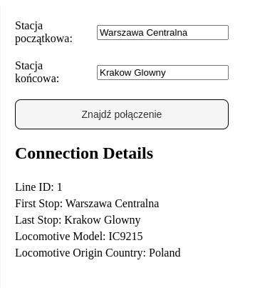
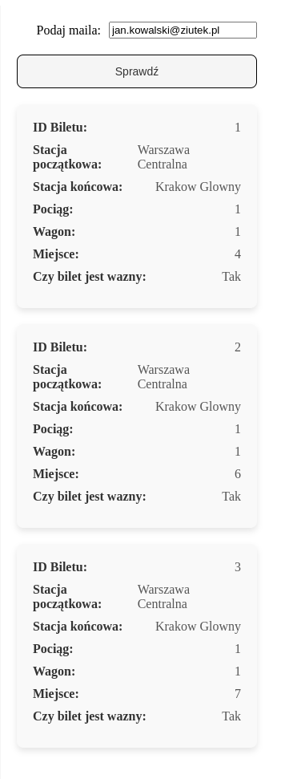
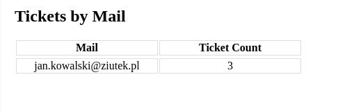

# Bazy Danych 2 - Projekt

## Wstęp



Wykonany projekt polega na utworzeniu aplikacji zajmującej się symulacją ruchu kolejowego wraz z możliwością wyszukania połączenia i zakupu biletu. Aplikacja podzielona jest na trzy wartwy - Aplikacyjną (frontend), Backend oraz bazę danych. Zgodnie z instrukcją, projekt skupia się głównie na implementacji bazy danych i jej połączeniu z aplikacją, zatem warstwa aplikacjyjna jest w dużym stopniu demonstracyjna (brak podziału na panele użytkownika/administratora itd.)

## Technologie

Użyte technologie prezentują się następująco
* Frontend - React JS, Vite
* Backend - Spring Boot
* Baza Danych - H2

## Baza danych

Pracę nad projektem rozpoczęliśmy od pojęciowego zapisu problemu:
> **Pociągi**, składające się z **wagonów** oraz **lokomotyw** kursują po **liniach**, w których skład wchodzą **stacje**. Znajdują się one w konkretnych **miastach** w Polsce. Dodatkowo, istnieje możliwość zakupu biletu. **Użytkownik** kupuje **bilet** w serwisie on-line na dane połączenie.

Na tej podstawie wyszczególniliśmy następujące encje w modelu E-R:
* Train
* Wagon
* Locomotive
* Line
* Linestop - reprezentuje pojedynczy przystanek dla danej linii
* Station
* City
* Traveler
* Ticket



Po przekształceniu do modelu logicznego, model wygląda następująco:



## Implementacja modelu w SQL

Model zaimplementowany w SQL:

```sql
CREATE TABLE Cities (
	city_id			INT				PRIMARY KEY AUTO_INCREMENT,
	name			VARCHAR(50)		NOT NULL
);

CREATE TABLE Stations (
	station_id		INT				PRIMARY KEY AUTO_INCREMENT,
	name			VARCHAR(50)		NOT NULL UNIQUE,
	city_id			INT				NOT NULL,

	FOREIGN KEY (city_id) REFERENCES Cities(city_id)
);

CREATE TABLE Travelers (
	traveler_id		INT				PRIMARY KEY AUTO_INCREMENT,
	first_name		VARCHAR(50)		NOT NULL,
	last_name		VARCHAR(50)		NOT NULL,
	mail_address	VARCHAR(50)		NOT NULL
);

CREATE TABLE Lines (
	line_id			INT				PRIMARY KEY AUTO_INCREMENT,
	name			VARCHAR(50)		NOT NULL UNIQUE
);

CREATE TABLE Linestops (
	linestop_id		INT				PRIMARY KEY AUTO_INCREMENT,
	next_linestop	INT,
	distance_next	INT,
	station_id		INT				NOT NULL,
	line_id			INT				NOT NULL,
	is_first		BOOLEAN			DEFAULT FALSE,

	FOREIGN KEY (line_id) REFERENCES Lines(line_id),
	FOREIGN KEY (station_id) REFERENCES Stations(station_id),
	FOREIGN KEY (next_linestop) REFERENCES Linestops(linestop_id)
);


CREATE TABLE Locomotives (
	locomotive_id	INT				PRIMARY KEY AUTO_INCREMENT,
	model			VARCHAR(100)	NOT NULL,
	origin_country	VARCHAR(100)	NOT NULL
);

CREATE TABLE Trains (
	train_id		INT				PRIMARY KEY AUTO_INCREMENT,
	line_id			INT				NOT NULL,
	locomotive_id	INT				NOT NULL,
	curr_linestop	INT,

	FOREIGN KEY (line_id) REFERENCES Lines(line_id),
	FOREIGN KEY (curr_linestop) REFERENCES Linestops(linestop_id),
	FOREIGN KEY (locomotive_id) REFERENCES Locomotives(locomotive_id)
);

CREATE TABLE Tickets (
	ticket_id		INT				PRIMARY KEY AUTO_INCREMENT,
	traveler_id		INT				NOT NULL,
	first_stop		INT				NOT NULL,
	last_stop		INT				NOT NULL,
	train_id		INT				NOT NULL,
	wagon_num		INT				NOT NULL,
	seat_num		INT,
	is_expired		BOOLEAN			DEFAULT FALSE,

	FOREIGN KEY (traveler_id) REFERENCES Travelers(traveler_id),
	FOREIGN KEY (train_id) REFERENCES Trains(train_id),
	FOREIGN KEY (first_stop) REFERENCES Linestops(linestop_id),
	FOREIGN KEY (last_stop) REFERENCES Linestops(linestop_id)
);


CREATE TABLE Wagons (
	wagon_id		INT				PRIMARY KEY	AUTO_INCREMENT,
	wagon_num		INT				NOT NULL,
	wagon_capacity	INT,
	train_id		INT,

	FOREIGN KEY (train_id) REFERENCES Trains(train_id)
);
```

## Połączenie bazy danych z warstwą backend

Zaimplementowana została paczka do zarządzania bazą danych - dbservice - składająca się z dedykowanych interfejsów dla każdej tabeli w bazie danych oraz metod obsługujących potrzebne żądania

Główna klasa - ``DatabaseController`` wystawia konkretne metody publiczne do użycia przez interfejs zarządzania endpointami (``DataController``). Konkretne modele (np. ``Train.java``) są bezpośrednią implementacją wierszy tabeli jako klasy. Klasy ``DAO`` zarządzają przesyłaniem zapytań SQL.

## Front-end

Na stronie zbudowanej w react.js możemy zobaczyć symulację pociągów jeżdżących po Polsce. Po kliknięciu na konkretny pociąg wyświetlają nam się miejsca wolne oraz zajęte w danym pociągu. 
Po kliknięciu na dane miejsce, jeśli jest zajęte ujrzymy dane pasażera, do którego to miejsce należy. Inną opcją strony jest możliwość zakupu biletu, sprawdzenie połączenia oraz sprawdzenie wybranych przez nas statystyk
takich jak: lista stacji, lista aktywnych połączeń czy licza biletóœ zakupionych przez dany e-mail.

Docelowe pliki znajdują się w folderze front_merge, w którym jest src. W folderze src znajdują się pliki tworzące strone a w podfolderze Canvas są pliki tworzące symulację.
Strona jest zbudowana na narzędziu Vite.


Fragment kodu, w którym zostaje wysłane zapytanie do backendu o wszystkie dostępne stacje:
```javascript
try {
    const response = await axios.get("http://localhost:8080/data/all_stations");
    const allStations = response.data;
    const stationNames = allStations.map(station => station.name);
    setFirstStationInDataBase(stationNames.includes(startStation));
    setLastStationInDataBase(stationNames.includes(endStation));

    if (!stationNames.includes(startStation) || !stationNames.includes(endStation)) {
        console.error("We don't have these stations in our database");
        return;
    }
} catch (error) {
    console.error("Error loading all available stations in our database", error);
    return;
}
```

Wysłanie danych kupującego bilet do backendu:
```javascript
try {
    await axios.post('http://localhost:8080/data/add_traveler', null, {
        params: {
            first_name: firstName,
            last_name: lastName,
            mail: mail
        }
    });
    console.log("Traveler added successfully");
    const response = await axios.get("http://localhost:8080/data/get_traveler_id_by_mail", {
        params: { mail: mail }
    });
    travelerID = response.data;
    console.log(travelerID);
} catch (error) {
    console.error("Error adding traveler or fetching traveler ID:", error);
    return;
```

Wysyłanie danych potrzebnych do kupienia biletu, wprowadzonych na stronie, do backendu:
```javascript
try {
    const response = await axios.post('http://localhost:8080/data/add_ticket', null, {
        params: {
            traveler_id: travelerID,
            first_stop: lineData[1],
            last_stop: lineData[2],
            train_id: foundTrainId,
            wagon_num: wagon,
            seat_num: seat
        }
    });
    console.log("Ticket added successfully");
    const ticketResponse = await axios.get('http://localhost:8080/data/tickets_by_mail', {
        params: { mail: mail }
    });
    const tickets = ticketResponse.data;
    setTicketId(tickets[tickets.length - 1].ticket_id);
    setIsSubmitted(true);
} catch (error) {
    console.error("Error adding ticket or fetching ticket ID:", error);
}
```

## Symulacja

Po zakupie biletu:


Po dojechaniu na miejsce:


Znajdywanie Polaczenia


Sprawdzanie biletów


Statystyki:

